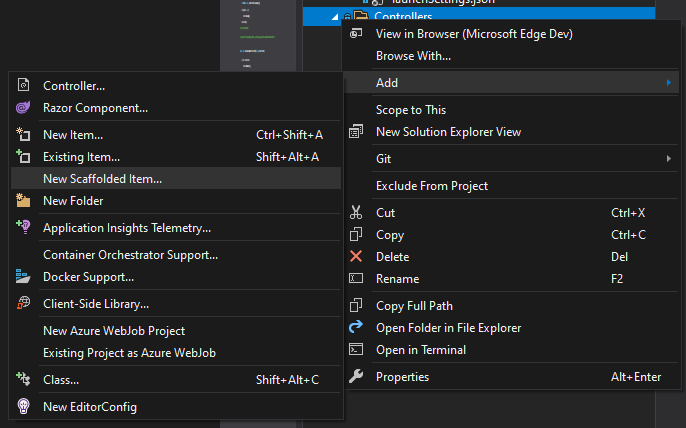
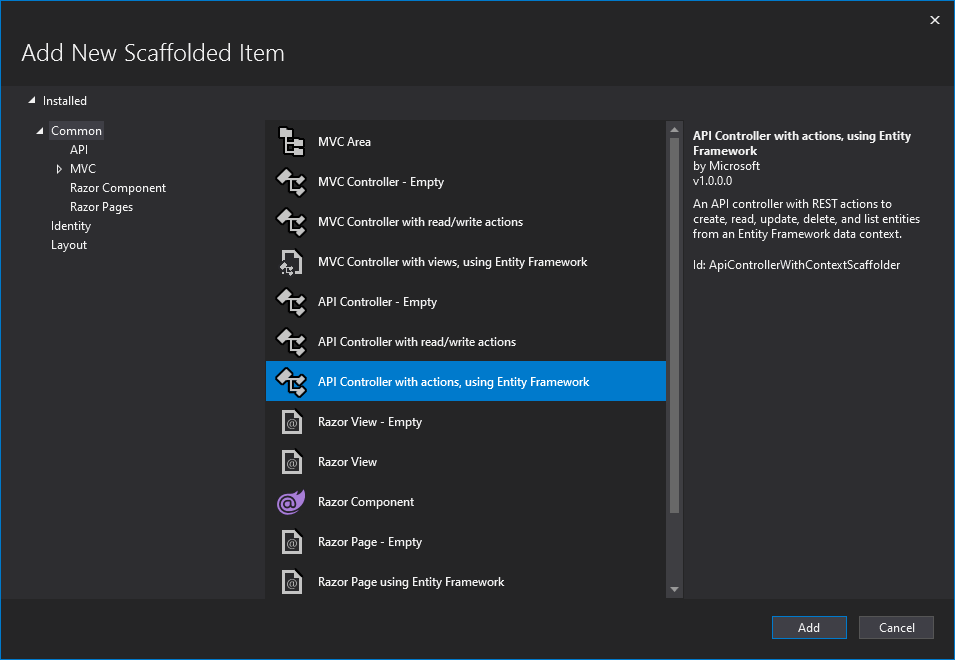
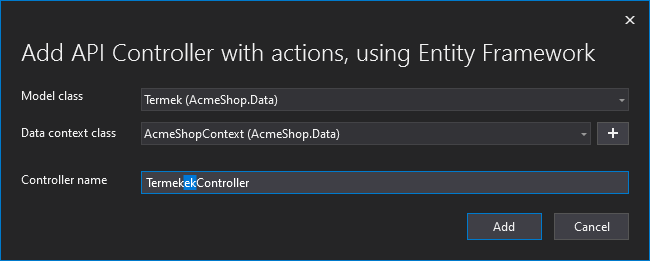

# ASP.NET Core Web API és többrétegű alkalmazásarchitektúra

## Célkitűzés

Egyszerű REST- vagy webszolgáltatások készítésének alapszintű elsajátítása.

## Előfeltételek

A labor elvégzéséhez szükséges eszközök:

- Microsoft SQL Server (LocalDB vagy Express edition, Visual Studio telepítővel telepíthető)
- Visual Studio 2022 .NET 6 SDK-val telepítve

Amit érdemes átnézned:

- EF Core előadás anyaga
- ASP.NET Core előadások anyaga
- A használt adatbázis [sémája](https://BMEVIAUBB04.github.io/gyakorlat-mssql/sema.html)

## Feladat 0: Kiinduló projekt letöltése, indítása

Az előző laborokon megszokott adatmodellt fogjuk használni MS SQL LocalDB segítségével. Az adatbázis sémájában néhány mező a .NET-ben ismeretes konvencióknak megfelelően átnevezésre került, felépítése viszont megegyezik a korábban megismertekkel.

1. Töltsük le a GitHub repository-t a reposiory főoldaláról (https://github.com/BMEVIAUBB04/gyakorlat-rest-web-api > *Code* gomb, majd *Download ZIP*) vagy a közvetlen [letöltő link](https://github.com/BMEVIAUBB04/gyakorlat-rest-web-api/archive/refs/heads/master.zip) segítségével. 
2. Csomagoljuk ki
3. Nyissuk meg a kicsomagolt mappa AcmeShop alkönyvtárban lévő solution fájlt.

A kiinduló solution egyelőre egy projektből áll:`AcmeShop.Data`: EF modellt, a hozzá tartozó kontextust (`AcmeShopContext`) tartalmazza. Hasonló az EF Core gyakorlaton generált kódhoz, de ez Code-First migrációt is tartalmaz (`Migrations` almappa).

## Feladat 1: Webes projekt elkészítése

1. Adjunk a solutionhöz egy új web projektet
    - Típusa: ASP.NET Core Web API (**nem Web App!**)
    - Neve: *AcmeShop.Api*
    - Framework: .NET 6.0
    - Authentication type: *None*
    - HTTPS, Docker: kikapcsolni
    - Use controllers, Enable OpenAPI support: bekapcsolni

2. Függőségek felvétele az új projekthez
    - adjuk meg projektfüggőségként az `AcmeShop.Data`-t
    - adjuk hozzá a *Microsoft.EntityFrameworkCore.Design* NuGet csomagot

3. Adatbáziskapcsolat, EF beállítása
    - connection string beállítása a konfigurációs fájlban (appsettings.json). A nyitó `{` jel után
```javascript
 "ConnectionStrings": {
   "AcmeShopContext": "Data Source=(localdb)\\MSSQLLocalDB;Initial Catalog=AcmeShop"
 },
```
   - connection string kiolvasása a konfigurációból, `AcmeShopContext` példány konfigurálása ezen connection string alapján, `AcmeShopContext` példány regisztrálása DI konténerbe. Program.cs-be, a `builder.Build()` sor elé:
```csharp
builder.Services.AddDbContext<AcmeShopContext>(
    options => options.UseSqlServer(
        builder.Configuration.GetConnectionString(nameof(AcmeShopContext))));
```

4. Adatbázis inicializálása Package Manager Console (PMC)-ban
   - Indítandó projekt az `AcmeShop.Api` projekt legyen (jobbklikk az AcmeShop.Api-n > *Set as Startup Project*)
   - A PMC-ben a Defult projekt viszont az `AcmeShop.Data` legyen
   - PMC-ből generáltassuk az adatbázist az alábbi paranccsal
```powershell
Update-Database
```


## Feladat 1: Generált kód vizsgálata, JSON referenciák kezelése

Az első indulást követően egy Swagger UI fogad minket, amin a kiinduló projektbe generált `WeatherForecastController` egyetlen, HTTP GET igére reagáló végpontját láthatjuk, amit a `​/WeatherForecast` URL-en érhetünk el. A `WeatherForecastController.Get()` metódusa nem vár paramétert, és egy 5 db véletlenszerű WeatherForecast elemet tartalmazó `IEnumerable<WeatherForecast>` elemmel tér vissza.

A Swagger UI-t használhatjuk az API tesztelésére, nyomjuk meg a UI-on látható `GET`, `Try it out`, majd az `Execute` feliratú gombot!


Láthatjuk alul a küldött üzenetet (jelenleg query paramétereket sem fogadó GET kérés esetén ez csak az URL-t jelenti), az arra kapott válasz státuszkódját és formázott JSON törzsét. Megnézhetjük alább a kérés kapcsán használt objektumok sematikus leírását is. Fontos észrevenni, hogy az egész alkalmazásban nem jelöltük sehol, hogy JSON alapú kommunikációt végzünk; az API végponton egyszerűen az eredményhalmazt tartalmazó objektummal tértünk vissza. A keretrendszer a kliens által küldött kérés `Accept*` fejlécmezői alapján döntötte el, hogy JSON sorosítást alkalmaz (ami egyébként az alapértelmezett), de volna lehetőség további sorosítókat is alkalmazni (pl. XML-t vagy akár CSV-t).

Az alkalmazás teljes konfigurációs kódja nem sok, a Startup.cs fájlban láthatjuk a függőségek regisztrációját (`ConfigureServices`) és a kiszolgálási csővezeték konfigurációját (`Configure`). Láthatjuk, hogy a szükséges szolgáltatásokat a `ConfigureServices` `services` paraméterébe regisztrálhatjuk be (ezután használhatjuk konstruktor injektálással pl. Controllerekbe), és azokat az elemeket, amik a HTTP kérésünk kiszolgálásában közvetlenül játszanak szerepet, a middleware konfigurációnál tehetjük meg. A legtöbb third-party komponens szolgáltat számunkra szolgáltatások is, és elérhetővé tesz végpontokat is, ezt láthatjuk pl. a Swagger UI kapcsán:
- a `services.AddSwaggerGen` hívás a megfelelő szolgáltatástípusokat konfigurálja fel és teszi elérhetővé az alkalmazás többi része számára,
- az `app.UseSwagger` és `app.UseSwaggerUI` hívások pedig a Swagger JSON leíróját és a UI-t ajánlják ki egy-egy meghatározott HTTP végponton *kizárólag Development környezetben*.

Vegyünk fel egy új Controllert, aminek segítségével manipulálni tudjuk az adatbázist egy REST API-n keresztül! A leggyorsabb módja ennek a kódgenerálás (scaffolding).

Kattintsunk jobb klikkel a Controllers mappán, majd válasszuk az "Add -> New Scaffolded Item...", aztán az "API Controller with actions, using Entity Framework" lehetőséget. 




A következő lehetőségnél válasszuk ki a Termek entitást, az egyetlen adatbáziskontextusunkat, végül pedig **figyeljünk**, hogy a controller neve helyesen **TermekekController** legyen, különben nem fognak megfelelően működni a controllerhez tartozó URL-ek.



Nem lesz szükségünk a WeatherForecast "modell" osztályra és az ehhez tartozó példa controllerre, ezeket töröljük ki!

Indítsuk újra az alkalmazást, nézzük meg, milyen végpontokat látunk a Swagger UI szerint!


Elég sok végpontot látunk, gyakorlatilag a CRUD műveletek mindegyikét megtaláljuk (R-ből kettő van, így összesen 5 végpont), valamint meglepően sok modell sémát. A GET-es kérésünk például bár csak egy terméket tartalmaz, amihez tartozik egy ÁFA és egy kategória, de tartoznak a termékekhez megrendelések is, amin keresztül gyakorlatilag a teljes fennmaradó adattartalma az adatbázisnak elérhető lesz nekünk... ide értve a felhasználó féltett `Jelszo` mezőjét is a `Termek.MegrendelesTetelek.Megrendeles.Telephely.Vevo` tulajdonságláncon át.


Futassuk az első GET lekérdezést!

Ezek után a helyes reakció, hogy az egyik szemünk sír, amíg a másik nevet. Az alábbi tanulságokat tudjuk levonni a forráskód vizsgálata után:
- A kérések nagyon könnyen legenerálódtak, sőt, olyan szélsőséges esetekre is felkészültünk, mint például idő közben törölt termék módosításának kísérlete.
- A navigation property-k nincsenek betöltve, ezért az összes ilyen tulajdonság az entitásban null. Ha ezeket be szeretnénk tölteni, arról magunknak kell gondoskodni.

A módosítás PUT műveletben a `Termek termek` JSON objektumot deszerializálva validáció nélkül mentjük az adatbázisba. Ha a `Vevo` entitáshoz is generáltunk volna végpontokat, akkor egyszerű (és inkorrekt) volna megváltoztatni a vevők jelszavát ilyen módon.

A `GET /api/Termekek` végpontnak megfelelő Controller action törzsét módosítsuk az alábbinak megfelelően:

``` C#
return await _context.Termek.Include(t => t.MegrendelesTetelek).ToListAsync();
```

Hibát kapunk, ugyanis a JSON objektumban végtelen ciklus keletkezett a navigation property hatására. Miért? A Termek és a Termek.MegrendelesTetelek.Termek ugyanarra az objektumra mutat, ezért ennek a sorosítása a klasszikus értelemben véve problémás. Ezt kiküszöbölhetjük a .NET beépített JSON sorosítójának konfigurációjával. A Startup fájlban konfiguráljuk megfelelően a sorosítót, hogy a referenciákat valóban referenciaként kezelje:

``` C#
//services.AddControllers();
services.AddControllers().AddJsonOptions(o => o.JsonSerializerOptions.ReferenceHandler = ReferenceHandler.Preserve);

```

Ezután az alábbihoz hasonló JSON választ fogunk kapni eredményül: 

``` JSON
{
  "$id": "1",
  "$values": [
    {
      "$id": "2",
      "id": 1,
      "nev": "Activity playgim",
      "nettoAr": 7488,
      "raktarkeszlet": 21,
      "afaId": 3,
      "kategoriaId": 8,
      "leiras": "<termek><termek_meret><mertekegyseg>cm</mertekegyseg><szelesseg>150</szelesseg><magassag>50</magassag><melyseg>150</melyseg></termek_meret><csomag_parameterek><csomag_darabszam>1</csomag_darabszam><csomag_meret><mertekegyseg>cm</mertekegyseg><szelesseg>150</szelesseg><magassag>20</magassag><melyseg>20</melyseg></csomag_meret></csomag_parameterek><leiras>\r\n                \t\tElemmel mukodik, a csomag nem tartalmay elemet.\r\n                \t</leiras><ajanlott_kor>0-18 hónap</ajanlott_kor></termek>",
      "kep": null,
      "afa": null,
      "kategoria": null,
      "megrendelesTetelek": {
        "$id": "3",
        "$values": [
          {
            "$id": "4",
            "id": 4,
            "mennyiseg": 2,
            "nettoAr": 7488,
            "megrendelesId": 2,
            "termekId": 1,
            "statuszId": 5,
            "megrendeles": null,
            "statusz": null,
            "termek": {
              "$ref": "2"
            },
            "szamlaTetelek": null
          },
          {
            "$id": "5",
            "id": 13,
            "mennyiseg": 25,
            "nettoAr": 7488,
            "megrendelesId": 4,
            "termekId": 1,
            "statuszId": 3,
            "megrendeles": null,
            "statusz": null,
            "termek": {
              "$ref": "2"
            },
            "szamlaTetelek": null
          }
        ]
      }
    },
    // ...
  ]
}
```

Vegyük észre, hogy minden objektum sorosítása *alapvetően* megváltozott. Minden létező objektum kapott egy új, `$id` névre hallgató JSON mezőt, amely egy olyan értéket tartalmaz, ami kizárólag a JSON dokumentumon *belül* értelmezhető (tehát két külön JSON dokumentumban szereplő 1-es `$id`-jú elem nem ugyanazt a valós elemet reprezentálja). Ugyanez az érték bármely más ponton referálva lehet, például a termékünkhöz tartozó `megrendelesTetelek` mező elemeinek `termek` mezője visszareferál a szülőre (2-es `$id`-val). Emiatt **ezek az objektumok nem is felelnek meg az eredeti sémának**. Ugyanígy, mivel a tömbök is referenciák, ezért nem egyszerű JSON tömbként vannak sorosítva, hanem ők is kaptak egy `$id` értéket, az eredeti értékeik pedig ebben az új tömb "objektumban", a `$values` értékben találhatók.

Most, hogy ezzel megvagyunk, egészítsük ki a GET lekérdezésünket a további kapcsolatokkal:

``` C#
return await _context.Termek.Include(t => t.MegrendelesTetelek)
                                .ThenInclude(mt => mt.Megrendeles)
                                    .ThenInclude(m => m.Telephely)
                                        .ThenInclude(t => t.Vevo)
                            .ToListAsync();
```

Most újból futtathatjuk a lekérdezést... de ismét hibát kapunk. A JSON túl "mély", azaz túl sok objektum van egymásba ágyazva benne. Az MVC alapbeállítása `32`, ezt vigyük fel a .NET `System.Text.Json` API-jának egyébként is használt alapértékére, `64`-re a Startup.cs-ben:

``` C#
services.AddControllers().AddJsonOptions(o =>
{
    o.JsonSerializerOptions.ReferenceHandler = ReferenceHandler.Preserve;
    o.JsonSerializerOptions.MaxDepth = 64;
});
```

Ha futtatjuk a lekérdezést, láthatjuk, hogy ezzel ténylegesen **lekérjük a vevőket is, beleértve a vevők jelszó mezőjét**. 

Tanulságok:
- Egyrészt (remélhetőleg) tudjuk, hogy a jelszavakat számos okból kifolyólag nem tároljuk adatbázisban nyers szöveg formájában. Nem is tároljuk őket egyszerű hasheléssel (mert azonos jelszavakhoz azonos hash-ek fognak tartozni). Ehelyett megbízható kriptografikus hashfüggvényt és véletlen salt értéket tárolunk.
- Az entitás jellemzően nem alkalmas arra, hogy hálózaton közlekedjen. Az entitás az adatbázisunk struktúráját írja le, teljesen más absztrakciós szintet képvisel, mint a hálózati réteg, amin az alkalmazás kliensei számára nyújtunk egy programozási felületet. Ezt **absztrakció-szivárgásnak** nevezzük, ami hatalmas biztonsági rés, ugyanis könnyen tudunk érvelni alacsonyabb szinten levő absztrakciókról is, ha az entitások "utaznak a dróton".
- Az `Include`-ok felesleges komplexitást tesznek a lekérdezésbe, valamint gyakorlatilag a teljes `Termek` tábla tartalmát gondolkodás nélkül szolgáltattuk a kliens számára (tény, hogy csak néhány termékünk van, de valós esetben ez egy többezer sor méretű tábla kell, hogy legyen, esetleg bináris erőforrásokkal együtt).
- A scaffolding ebben az esetben legfeljebb gyors prototipizálásra jó, **production környezetben ne használjuk**! Gyakorlatilag kiiktattuk az alkalmazásunk minden közbülső rétegét, és közvetlen elérést engedtünk a végfelhasználónak az adatbázishoz (egy kevésbé optimális absztrakción keresztül).

## Feladat 2: Üzleti logikai réteg architekturális felépítése

> "Most pedig csináljuk vissza, amit elrontottunk..."

Szóval a JSON sorosító felkonfigurálása az adott pillanatban **jó ötletnek tűnt**, de a háttérben sokkal nagyobb hibát vétettünk, az egyik lehető legdrágábbat: *architekturális hibát*.

Ha az alkalmazásunk korrekten rétegelt, az adatréteg és a kommunikációs réteg megfelelően szeparált, akkor ez a probléma nem jön elő. Ugyanis tudjuk, hogy ha a hálózaton sorosítani szeretnénk objektumokat, akkor intuitívan automatikusan nem fogunk rekurzív referenciákat alkalmazni. Sőt, a REST alapelveit követve az első feladatunk az lett volna, hogy **azonosítjuk az erőforrásokat, amiket lekérdezni és manipulálni lehet**. A termék ettől függetlenül továbbra is jó ötlet, viszont magát az entitás hálózaton való sorosítását felejtsük el! A terméket ún. [**aggregate root**](https://en.wikipedia.org/wiki/Domain-driven_design#Building_blocks)nak fogjuk tekinteni.

Hozzunk létre tehát egy szolgáltatás/üzleti logikai réteget, amivel szeparáljuk a kommunikációs/hálózati és az adatrétegbeni feladatokat! 
1. A solution-ön jobb klikk -> Add -> New project..., majd válasszuk a Class Library (C#) lehetőséget. A projekt neve legyen `AcmeShop.Bll` (mint **B**usiness **L**ogic **L**ayer), a .NET verzió .NET 5.0. Fontos, hogy a projekt neve helyesen legyen megadva, különben a projektben található névterek is hibásak lesznek!
2. Hozzunk létre a BLL-ben egy `Models` "osztályt", a fájl teljes tartalmát pedig cseréljük le az alábbira:
    ``` C#
    namespace AcmeShop.Bll.Models
    {
        public sealed record TermekDto(int Id, string Nev, double? NettoAr, int? Raktarkeszlet, int? AfaKulcs, int? KategoriaId, string Leiras) { }

        public sealed record KategoriaDto(int Id, string Nev, int? SzuloKategoriaId) { }
    }
    ```
3. Hozzunk létre ezután egy `TermekService` osztályt, az alábbi tartalommal:
    ``` C#
    public interface ITermekService
    {
        Task<IReadOnlyCollection<KategoriaDto>> GetKategoriakAsync();
        Task<IReadOnlyCollection<TermekDto>> GetTermekekAsync();
    }
    public class TermekService : ITermekService
    {
        public Task<IReadOnlyCollection<KategoriaDto>> GetKategoriakAsync()
        {
            throw new NotImplementedException();
        }

        public Task<IReadOnlyCollection<TermekDto>> GetTermekekAsync()
        {
            throw new NotImplementedException();
        }
    }
    ```

Az üzleti logikai réteget kössük be az alkalmazásba! A projektek referenciáit rétegelten állítsuk be: az `Api` ismeri a `Bll`-t, a `Bll` ismeri a `Data`-t.
1. Az `Api` projekten jobb klikk, Add..., Project Reference... Állítsuk be, hogy ismeri a Bll-t, és **nem ismeri a Data**-t.
2. A `Bll` projekten ugyanígy, ő viszont csak a `Data`-t ismeri.

Ha most fordítjuk, futtatjuk az alkalmazást, akkor semmi nem változott. Ez azért van, mert .NET-ben a projektreferenciák alapértelmezetten "tranzitívak", ami azt jelenti, hogy mivel az `Api` ismeri a `Bll`-t, az pedig a `Data`-t, ezért az `Api` közvetetten, de ismeri a `Data`-t. Most azt szeretnénk, ha ez nem így történne. Erre több lehetőségünk is van, a leggyorsabb az alábbi:

3. A solution-ön jobb klikk -> Add -> New Item..., majd válasszuk az "XML file" lehetőséget, és adjuk neki (pontosan!) az alábbi nevet: `Directory.Build.props`. Ez a solution minden projektjére közös beállításokat tartalmaz.
4. A fájl tartalma legyen az alábbi:
    ``` XML
    <Project>
      <PropertyGroup>
        <DisableTransitiveProjectReferences>true</DisableTransitiveProjectReferences>
      </PropertyGroup>
    </Project>
    ```

Ha most fordítjuk az appot, akkor nem fordul! Szerencsére, ugyanis pont ezt akartuk. 10 db fordítási hibánk van, ahol megpróbáltuk közvetlenül elérni az adatréteget az `Api` projektből.

Egyrészt, a `TermekekController` már tudjuk, hogy koncepciójában is hibás (az entitás ne is legyen a controller rétegben ismert fogalom). Másrészt, a Program és Startup fájlok közvetlenül a AcmeShopContext-et próbálják használni. Javítsuk ki a felelősségi körök eme szörnyű megsértését!
1. Töröljük ki az `Api/Controlleres/TermekekController`-t!
2. Hozzunk létre egy új osztályt a `Bll`-ben `DependencyInjectionExtensions` néven az alábbi tartalommal. Ez lesz felelős az adatréteg bekötéséért a Dependency Injection IoC konténerbe, ill. az app indulásakor történő esetleges DB migrációért.
    ``` C#
    using AcmeShop.Data;
    using Microsoft.EntityFrameworkCore;
    using Microsoft.Extensions.DependencyInjection;
    using System;
    using System.Linq;
    using System.Threading.Tasks;

    namespace AcmeShop.Bll
    {
        public static class DependencyInjectionExtensions
        {
            public static IServiceCollection AddAcmeShopBll(this IServiceCollection services, string connectionString) =>
                services.AddAcmeShopContext(connectionString).AddTermekService();

            public static IServiceCollection AddTermekService(this IServiceCollection services) =>
                services.AddScoped<ITermekService, TermekService>();

            public static IServiceCollection AddAcmeShopContext(this IServiceCollection services, string connectionString) =>
                services.AddDbContext<AcmeShopContext>(options => options.UseSqlServer(connectionString));

            public static async Task MigrateOrReacreateAcmeShopDatabaseAsync(this IServiceProvider serviceProvider)
            {
                var dbContext = serviceProvider.GetRequiredService<AcmeShopContext>();
                var allMigrations = dbContext.Database.GetMigrations().ToHashSet();
                var appliedMigrations = await dbContext.Database.GetAppliedMigrationsAsync();
                if (appliedMigrations.Any(m => !allMigrations.Contains(m)))
                {
                    await dbContext.Database.EnsureDeletedAsync();
                    await dbContext.Database.MigrateAsync();
                }
                else if (allMigrations.Any(m => !appliedMigrations.Contains(m)))
                    await dbContext.Database.MigrateAsync();
            }
        }
    }

    ```
3. Javítsuk ki a Program.cs-ben található hibát, tehát hívjuk meg a Bll megfelelő metódusát és ne közvetlenül babráljuk innen a DB-t:
    ``` C#
    using AcmeShop.Bll;
    using Microsoft.AspNetCore.Hosting;
    using Microsoft.Extensions.DependencyInjection;
    using Microsoft.Extensions.Hosting;
    using System.Threading.Tasks;

    namespace AcmeShop.Api
    {
        public static class Program
        {
            public static async Task Main(string[] args) =>
                (await CreateHostBuilder(args)
                        .Build()
                        .MigrateOrReacreateDatabaseAsync())
                    .Run();

            public static IHostBuilder CreateHostBuilder(string[] args) =>
                Host.CreateDefaultBuilder(args)
                    .ConfigureWebHostDefaults(webBuilder =>
                    {
                        webBuilder.UseStartup<Startup>();
                    });

            private static async Task<IHost> MigrateOrReacreateDatabaseAsync(this IHost host)
            {
                using var scope = host.Services.CreateScope();
                await scope.ServiceProvider.MigrateOrReacreateAcmeShopDatabaseAsync();
                return host;
            }
        }
    }
    ```
4. Végül pedig regisztráljuk be az alkalmazás BLL rétegének megfelelő szolgáltatásokat a szolgáltatáskonténerbe a `Startup.ConfigureServices`-ben, egyúttal pedig töröljük a JSON félrekonfigurációnkat:
    ``` C#
    public void ConfigureServices(IServiceCollection services)
    {
        // using AcmeShop.Bll;
        services.AddAcmeShopBll(Configuration.GetConnectionString("AcmeShopContext"));
        services.AddControllers();
        services.AddSwaggerGen(c =>
        {
            c.SwaggerDoc("v1", new OpenApiInfo { Title = "AcmeShop.Api", Version = "v1" });
        });
    }
    ```
5. Az esetleges hibás `AcmeShop.Data` névtér importálásokat töröljük az `Api` projektből.

Ha tetszik, ha nem; sikeresen felépítettük a szépen rétegelt üzleti alkalmazásunkat. Már csak a tényleges lekérdezés elkészítése van hátra.

## Feladat 3: Lekérdezés specifikáció szerint

A [specifikáció minta](https://en.wikipedia.org/wiki/Specification_pattern) egyik variánsa, amikor egy olyan objektumot készítünk, ami a szűrési feltételeket tartalmazza. Ez kombinálható különböző aspektusorientált műveletekkel (pl. attribútumok), amivel akár automatikusan felületet is generálhatunk. Nekünk most a Swagger UI lesz a "felületünk", ezért mi csak a műveletet fogjuk megvalósítani.

A specifikációs objektumunk egyszerű adat objektum, amit paraméterül fogunk várni az API-n. Hozzuk létre a `Bll`-ben.
``` C#
namespace AcmeShop.Bll
{
    public record TermekSpec(
        int Oldal,
        int Oldalmeret,
        int? Id, 
        string NevContains, 
        double? NettoArMinimum, 
        double? NettoArMaximum, 
        int? KategoriaId, 
        bool? Raktaron) 
    { }
}
```

Módosítsuk ennek megfelelően a `TermekService`-t és interfészét, egyúttal implementáljuk a szolgáltatást! Trükközhetünk a konstruktor injektálással jóval rövidebb szintaxissal, ha a szolgáltatásunk is `record` típusú.

``` C#
using AcmeShop.Bll.Models;
using AcmeShop.Data;
using Microsoft.EntityFrameworkCore;
using System;
using System.Collections.Generic;
using System.Linq;
using System.Threading.Tasks;

namespace AcmeShop.Bll
{
    public interface ITermekService
    {
        Task<IReadOnlyCollection<KategoriaDto>> GetKategoriakAsync();
        Task<IReadOnlyCollection<TermekDto>> GetTermekekAsync(TermekSpec spec);
    }
    public record TermekService(AcmeShopContext DbContext) : ITermekService
    {
        public async Task<IReadOnlyCollection<KategoriaDto>> GetKategoriakAsync() =>
            await DbContext.Kategoria.Select(k => new KategoriaDto(k.Id, k.Nev, k.SzuloKategoriaId)).ToListAsync();

        public async Task<IReadOnlyCollection<TermekDto>> GetTermekekAsync(TermekSpec spec)
        {
            var termekek = DbContext.Termek.AsQueryable();
            if (spec.Id != null)
                termekek = termekek.Where(t => t.Id == spec.Id);
            if (spec.KategoriaId != null)
                termekek = termekek.Where(t => t.KategoriaId == spec.KategoriaId);
            if (spec.NettoArMaximum != null)
                termekek = termekek.Where(t => t.NettoAr <= spec.NettoArMaximum);
            if (spec.NettoArMinimum != null)
                termekek = termekek.Where(t => t.NettoAr >= spec.NettoArMaximum);
            if (!string.IsNullOrWhiteSpace(spec.NevContains))
                termekek = termekek.Where(t => t.Nev.Contains(spec.NevContains));
            if (spec.Raktaron != null)
                termekek = termekek.Where(t => spec.Raktaron == true ? t.Raktarkeszlet > 0 : t.Raktarkeszlet <= 0);
            var (oldal, oldalmeret) = (Math.Max(0, spec.Oldal), Math.Min(Math.Max(1, spec.Oldalmeret), 100));
            return await termekek
                .OrderBy(t => t.Nev)
                .Skip(oldal * oldalmeret)
                .Take(oldalmeret)
                .Select(t => new TermekDto(t.Id, t.Nev, t.NettoAr, t.Raktarkeszlet, t.Afa.Kulcs, t.KategoriaId, t.Leiras))
                .ToListAsync();
        }
    }
}

```

Ennél gyönyörűbb megoldást talán csak ritkán látunk. Az utolsó lépés a Controllerek létrehozása és a service megfelelő meghívása. Az egyszerűbb a `KategoriakController`, kezdjük tehát azzal (legyen egy új üres API Controller):
``` C#
using AcmeShop.Bll;
using AcmeShop.Bll.Models;
using Microsoft.AspNetCore.Mvc;
using System.Collections.Generic;
using System.Threading.Tasks;

namespace AcmeShop.Api.Controllers
{
    [Route("api/[controller]")]
    [ApiController]
    public class KategoriakController : ControllerBase
    {
        public KategoriakController(ITermekService termekService)
        {
            TermekService = termekService;
        }

        private ITermekService TermekService { get; }

        [HttpGet]
        public async Task<IReadOnlyCollection<KategoriaDto>> GetKategoriakAsync() => await TermekService.GetKategoriakAsync();
    }
}

```

Tesztelhetjük, működik.

Végül pedig a `TermekekController`t valósítjuk meg...

``` C#
using AcmeShop.Bll;
using AcmeShop.Bll.Models;
using Microsoft.AspNetCore.Mvc;
using System.Collections.Generic;
using System.Threading.Tasks;

namespace AcmeShop.Api.Controllers
{
    [Route("api/[controller]")]
    [ApiController]
    public class TermekekController : ControllerBase
    {
        public TermekekController(ITermekService termekService)
        {
            TermekService = termekService;
        }

        private ITermekService TermekService { get; }

        [HttpGet]
        public async Task<IReadOnlyCollection<TermekDto>> GetTermekekAsync(TermekSpec spec) => await TermekService.GetTermekekAsync(spec);
    }
}

```

Próbáljuk ki a lekérdezésünket!

---

Bónusz érdekességek:
- A controller réteg úgy jó, ha vékony. 
    - A feladata leírni, hogyan néz ki az API, ezt már önmagában azzal is teszi, hogy a megfelelő függvényszignatúrákat definiáljuk és a helyes attribútumokat helyezzük el a metóduson, paramétereken. 
    - Elvégzi az alapszintű authorizációt, de nem az üzleti logikai jogosultságellenőrzést. 
    - Elvégzi a HTTP kérés/válasz formázását, de nem az üzleti adatok manipulációját vagy transzformációját.
- A controller nem lehet `record`, mert `record` csak másik `record`-ból vagy "semmiből" (az Object-ből) származhat. Lehetne, de akkor nem kapnánk meg a `ControllerBase` nyújtotta szolgáltatásokat (pl. `HttpStatusCode` és egyéb kényelmi metódusok, `Request` és `Response` objektumok közvetlen elérése stb.).
- A bonyolultabb specifikációs minta komponálható, ÉS / VAGY stb. logikai operátorokat lehet vele megfogalmazni. Esetünkben csak egy egyszerű szűrő leíró. Ilyenkor illik legalább egy további tulajdonsággal szabályozhatóvá tenni a rendezés módját és irányát.
- Látjuk, hogy a specifikációban "értelmes" dolgokra akarunk szűrni, tehát nem a raktárkészlet konkrét számára, hanem arra, hogy van-e valami raktáron vagy nincs.
- Az entitás és DTO közötti transzformációt most a szolgáltatás végzi. Magát a lekérdezést is üzleti logikai fogalomként, és nem adatszintű fogalomként kezeljük. Ha így lenne, akkor további absztrakcióra volna szükség a BLL és adatréteg között.
- A max. oldalméret a szolgáltatásréteg miatt 100 (hasraütésszerűen). Eredetileg nem volt korlátozva a maximum lekérhető entitások száma.
- A DTO-kban használhatnánk kompozíciót, esetleg akár öröklést is, a példában nem volt rá szükség. Ez azért is van így, mert a kategóriát nem akartuk beletenni például a `TermekDto`-ba, ugyanis a kategóriák teljes listája külön lekérhető (ott viszont szűrésnek nem volt értelme). Az ÁFA Id-ja helyett (ami ebben a kontextusban nem értelmes adat) inkább az ÁFA-kulcs került a DTO-ba. Vegyük észre, hogy a DTO nem az adatbázis struktúráját írja le, hanem úgy reprezentálja a DB-ben található adatot, hogy azt könnyű legyen felhasználni, értelmezni.
  - Ugyanígy nem látjuk a DTO-ban a `Kep` bájt tömböt sem, a képet ugyanis érdemes külön HTTP végponton kiajánlani! Ha a JSON-be sorosítanánk meglevő kép bájt tömböt, az nagyon megnöveli a JSON méretét (kb. 3,5-szer nagyobb lesz, mint a nyers kép mérete), és egyébként sem szép dolog nyersen belekódolni a DTO-ba.

---

Az itt található oktatási segédanyagok a BMEVIAUBB04 tárgy hallgatóinak készültek. Az anyagok oly módú felhasználása, amely a tárgy oktatásához nem szorosan kapcsolódik, csak a szerző(k) és a forrás megjelölésével történhet.

Az anyagok a tárgy keretében oktatott kontextusban értelmezhetőek. Az anyagokért egyéb felhasználás esetén a szerző(k) felelősséget nem vállalnak.
