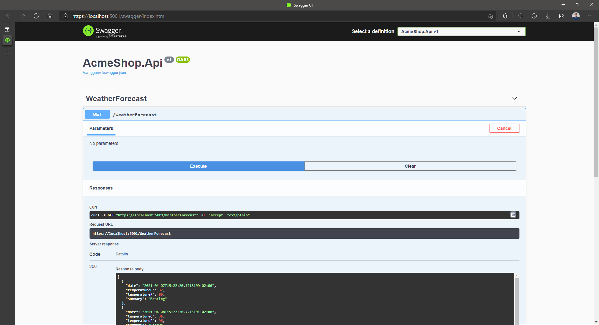
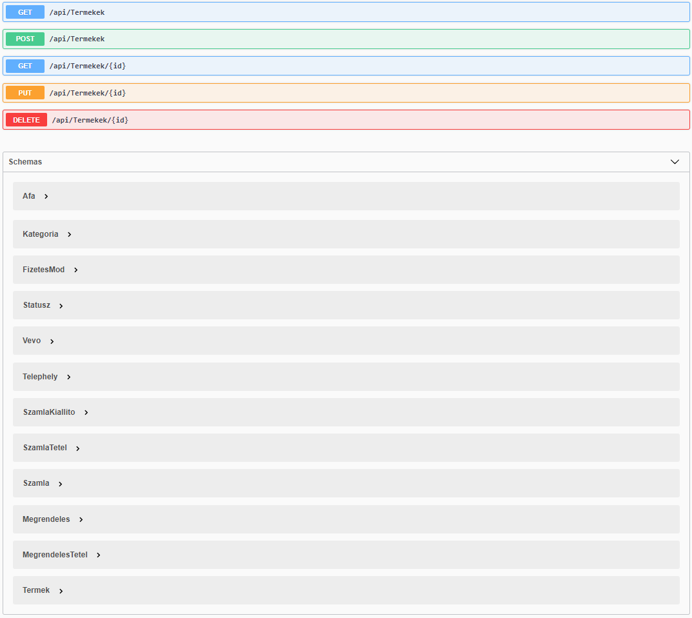
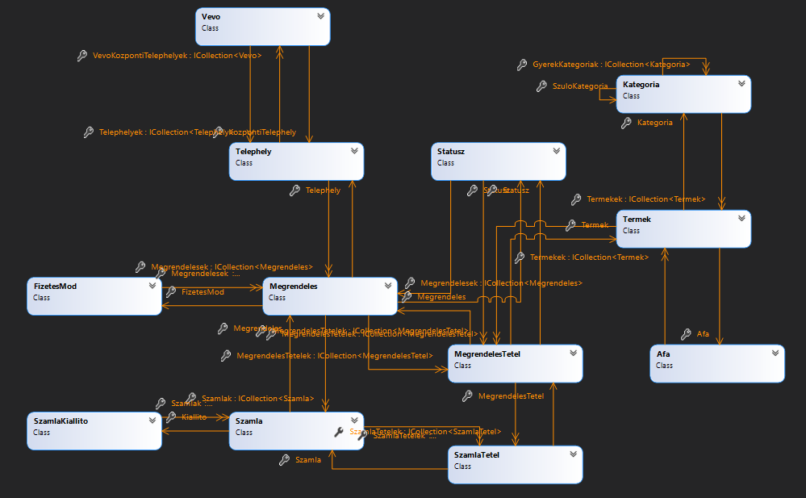

# ASP.NET Core Web API és többrétegű alkalmazásarchitektúra

## Célkitűzés

Egyszerű REST- vagy webszolgáltatások készítésének alapszintű elsajátítása.

## Előfeltételek

A labor elvégzéséhez szükséges eszközök:

- Microsoft SQL Server (LocalDB vagy Express edition, Visual Studio telepítővel telepíthető)
- Visual Studio 2022 .NET 8 SDK-val telepítve

Amit érdemes átnézned:

- EF Core előadás anyaga
- ASP.NET Core Web API előadás anyaga
- A használt adatbázis [sémája](https://BMEVIAUBB04.github.io/gyakorlat-mssql/sema.html)

## Feladat 0: Kiinduló projekt letöltése, indítása

Az előző laborokon megszokott adatmodellt fogjuk használni MS SQL LocalDB segítségével. Az adatbázis sémájában néhány mező a .NET-ben ismeretes konvencióknak megfelelően átnevezésre került, felépítése viszont megegyezik a korábban megismertekkel.

1. Töltsük le a GitHub repository-t a reposiory főoldaláról (https://github.com/BMEVIAUBB04/gyakorlat-rest-web-api > *Code* gomb, majd *Download ZIP*) vagy a közvetlen [letöltő link](https://github.com/BMEVIAUBB04/gyakorlat-rest-web-api/archive/refs/heads/master.zip) segítségével. 
2. Csomagoljuk ki.
3. Nyissuk meg a kicsomagolt mappa AcmeShop alkönyvtárban lévő solution fájlt.

A kiinduló solution egyelőre egy projektből áll:`AcmeShop.Data`: EF modellt, a hozzá tartozó kontextust (`AcmeShopContext`) tartalmazza. Hasonló az EF Core gyakorlaton generált kódhoz, de ez Code-First migrációt is tartalmaz (`Migrations` almappa).

## Feladat 1: Webes projekt elkészítése

1. Adjunk a solutionhöz egy új web projektet
    - Típusa: ASP.NET Core Web API (**nem Web App!**)
    - Neve: *AcmeShop.Api*
    - Framework: .NET 8.0
    - Authentication type: *None*
    - HTTPS, Docker: kikapcsolni
    - Do not use top-level statement: kikapcsolni
    - Use controllers, Enable OpenAPI support: bekapcsolni

1. Függőségek felvétele az új projekthez
    - adjuk meg projektfüggőségként az `AcmeShop.Data`-t
    - indítsuk el a Package Manager Console-t (PMC)
    - A PMC-ben a Defult projekt az `AcmeShop.Data` legyen
    - Adjuk hozzá a Microsoft.EntityFrameworkCore.Design csomagot:

    ```powershell
    Install-Package Microsoft.EntityFrameworkCore.Design -Version 8.0.13 
    ```

1. Adatbáziskapcsolat, EF beállítása
    - connection string beállítása a konfigurációs fájlban (appsettings.json). A nyitó `{` jel után
    ```javascript
     "ConnectionStrings": {
       "AcmeShopContext": "Data Source=(localdb)\\MSSQLLocalDB;Initial Catalog=AcmeShop"
     },
    ```
   - connection string kiolvasása a konfigurációból, `AcmeShopContext` példány konfigurálása ezen connection string alapján, `AcmeShopContext` példány regisztrálása DI konténerbe. Program.cs-be, a `builder.Build()` sor elé:
    ```csharp
    builder.Services.AddDbContext<AcmeShopContext>(
        options => options.UseSqlServer(
            builder.Configuration.GetConnectionString(nameof(AcmeShopContext))));
    ```

1. Ha van már adatbázis _AcmeShop_ néven, töröljük le.
1. Adatbázis inicializálása PMC-ban
   - Indítandó projekt az `AcmeShop.Api` projekt legyen (jobbklikk az AcmeShop.Api-n > *Set as Startup Project*), a Defult projekt maradjon az `AcmeShop.Data` legyen
   - PMC-ből generáltassuk az adatbázist az alábbi paranccsal
    ```powershell
    Update-Database
    ```

1. Projekt indítása

## Feladat 2: Webes projekt vizsgálata

Az első indulást követően egy Swagger UI fogad minket, amin a kiinduló projektbe generált `WeatherForecastController` egyetlen, HTTP GET igére reagáló végpontját láthatjuk, amit a `​/WeatherForecast` URL-en érhetünk el. A `WeatherForecastController.Get()` metódusa nem vár paramétert, és egy 5 db véletlenszerű WeatherForecast elemet tartalmazó `IEnumerable<WeatherForecast>` elemmel tér vissza.

A Swagger UI-t használhatjuk az API tesztelésére, nyomjuk meg a UI-on látható `GET`, `Try it out`, majd az `Execute` feliratú gombot!



Láthatjuk alul a küldött üzenetet (jelenleg query paramétereket sem fogadó GET kérés esetén ez csak az URL-t jelenti), az arra kapott válasz státuszkódját és formázott JSON törzsét. Megnézhetjük alább a kérés kapcsán használt objektumok sematikus leírását is. Fontos észrevenni, hogy az egész alkalmazásban nem jelöltük sehol, hogy JSON alapú kommunikációt végzünk; az API végponton egyszerűen az eredményhalmazt tartalmazó objektummal tértünk vissza. A keretrendszer a kliens által küldött kérés `Accept*` fejlécmezői alapján döntötte el, hogy JSON sorosítást alkalmaz (ami egyébként az alapértelmezett), de volna lehetőség további sorosítókat is alkalmazni (pl. XML-t vagy akár CSV-t).

Az alkalmazás teljes konfigurációs kódja nem sok, a Program.cs fájlban láthatjuk a függőségek regisztrációját (`builder.Services.AddXXX` sorok) és a kiszolgálási csővezeték konfigurációját (`app.UseXXX`). A legtöbb third-party komponens szolgáltat számunkra szolgáltatások is, és elérhetővé tesz végpontokat is, ezt láthatjuk pl. a Swagger UI kapcsán:
- a `services.AddSwaggerGen` hívás a megfelelő szolgáltatástípusokat konfigurálja fel és teszi elérhetővé az alkalmazás többi része számára,
- az `app.UseSwagger` és `app.UseSwaggerUI` hívások pedig a Swagger JSON leíróját és a UI-t ajánlják ki egy-egy meghatározott HTTP végponton.

## Feladat 3: Adatbázis objektumok lekérdezése

A `WeatherForecastController` nem használta az adatbázisunkat. Vegyünk fel egy új Controllert, aminek segítségével manipulálni tudjuk az adatbázist egy REST API-n keresztül! A leggyorsabb módja ennek a kódgenerálás (scaffolding).

1. Adjunk hozzá az API projekthez a *Microsoft.VisualStudio.Web.CodeGeneration.Design* NuGet csomagot. PMC-ben (default prject API legyn):
    ```powershell    
    Install-Package Microsoft.VisualStudio.Web.CodeGeneration.Design -Version 8.0.13 
    ```
2. Fordítsuk az API projektet.
3. PMC-ben telepítsük az ASP.NET Core kódgeneráló eszközt
    ```powershell
    dotnet tool install -g dotnet-aspnet-codegenerator
    ```
3. Lépjünk be a projekt könyvtárába
    ```powershell
    cd .\AcmeShop.Api
    ```
4. Generáljunk a kódgenerálóval REST API (`-api`) controllert a `Termek` entitáshoz (`-m`), mely a `AcmeShopContext` kontextushoz  (`-dc`) tartozik. A generált osztály neve legyen `TermekController` (`-name`), az `AcmeShop.Api.Controllers` névtérbe  (`-namespace`) kerüljön. A generált fájl a *Controllers* mappába (`-outDir`) kerüljön. 
    ```powershell
    dotnet aspnet-codegenerator controller -m AcmeShop.Data.Termek -dc AcmeShop.Data.AcmeShopContext -outDir Controllers -name TermekekController -namespace AcmeShop.Api.Controllers -api
    ```

Indítsuk újra az alkalmazást, nézzük meg, milyen végpontokat látunk a Swagger UI szerint!



Elég sok végpontot látunk, gyakorlatilag a CRUD műveletek mindegyikét megtaláljuk (R-ből kettő van, így összesen 5 végpont), valamint meglepően sok modell sémát. A GET-es kérésünk például bár csak egy terméket tartalmaz, amihez tartozik egy ÁFA és egy kategória, de tartoznak a termékekhez megrendelések is, amin keresztül gyakorlatilag a teljes fennmaradó adattartalma az adatbázisnak elérhető lesz nekünk... ide értve a felhasználó féltett `Jelszo` mezőjét is a `Termek.MegrendelesTetelek.Megrendeles.Telephely.Vevo` tulajdonságláncon át.



Futassuk az első GET lekérdezést!

Ezek után a helyes reakció, hogy az egyik szemünk sír, amíg a másik nevet. Az alábbi tanulságokat tudjuk levonni a forráskód vizsgálata után:
- a kérések nagyon könnyen legenerálódtak, sőt, olyan szélsőséges esetekre is felkészültünk, mint például idő közben törölt termék módosításának kísérlete.
- a navigation property-k nincsenek betöltve, ezért az összes ilyen tulajdonság az entitásban `null`. Ha ezeket be szeretnénk tölteni, arról magunknak kell gondoskodni.
- a módosítás PUT műveletben a `Termek termek` JSON objektumot deszerializálva validáció nélkül mentjük az adatbázisba. Ha a `Vevo` entitáshoz is generáltunk volna végpontokat, akkor egyszerű (és inkorrekt) volna megváltoztatni a vevők jelszavát ilyen módon.

A `GET /api/Termekek` végpontnak megfelelő kontroller művelet törzsében töltessük ki az EF-fel a `MegrendelesTetelek` navigációs property-t

``` C#
return await _context.Termek.Include(t => t.MegrendelesTetelek).ToListAsync();
```

Hibát kapunk, ugyanis a JSON objektumban végtelen ciklus keletkezett a navigation property hatására. Miért? A `Termek` és a `Termek.MegrendelesTetelek.Termek` ugyanarra az objektumra mutat, ezért ennek a sorosítása a klasszikus értelemben véve problémás. Ezt kiküszöbölhetnénk a .NET beépített JSON sorosítójának konfigurációjával, de ilyenkor erre a kliensoldali sorosítót is fel kell készíteni. Ha jobban átgondoljuk a helyzetet, nem a sorosítóval van a gond, sokkal inkább azzal, hogy közvetlenül az entitásmodell (egy részét) sorosítjuk - a problémáink is ebből adódnak.

Ebből is tászik, hogy a scaffolding ebben az esetben legfeljebb gyors prototipizálásra jó, **változtatás nélkül ne használjuk**! Gyakorlatilag közvetlen elérést engedünk a végfelhasználónak az adatbázishoz (egy kevésbé optimális absztrakción keresztül).

## Feladat 4: DTO-k lekérdezése

1. Hozzunk létre az API projektben egy új "osztályt" _DTOs.cs_ fájlban, a fájl teljes tartalmát pedig cseréljük le az alábbira:
    ``` C#
    namespace AcmeShop.Models;

    public record TermekDto(int Id, string Nev, double? NettoAr, int? Raktarkeszlet, int? AfaKulcs, int? KategoriaId, string Leiras);

    public record KategoriaDto(int Id, string Nev);
    ```
    
    Record típusok: egyszerűen (akár egy sorban) definiálható adatosztályok. A fenti szintaxissal megadott típusok referencia típusok lesznek, melyek:
    - a megadott konstruktorral példányosíthatóak
    - a konstruktorban megadott paramétereknek megfelelő (csak olvasható) property-kkel rendelkeznek
    - példányosítás után nem változtathatók az adataik
    - két példány összehasonlítása az adataik alapján történik, nem a memóriacím alapján
    
1. A `GET /api/Termekek` végpontnak megfelelő kontroller művelet törzsében `TermekDto`-t adjunk vissza `Temek` helyett
    ``` C#
    [HttpGet]
    public async Task<ActionResult<IEnumerable<TermekDto>>> GetTermek()
    {
       //return await _context.Termek.Include(t => t.MegrendelesTetelek).ToListAsync();
       return await _context.Termek.Select(t => new TermekDto(t.Id, t.Nev, t.NettoAr, t.Raktarkeszlet, t.Afa.Kulcs, t.KategoriaId, t.Leiras )).ToListAsync();
    }
    ```
    Jó hír, hogy a `Select` szépen feltölti a DTO-t még ha a kapcsolódó elemekhez is kell navigálni. Nem kell félnünk a `null` értékű navigciós propertyktől, például a `t.Afa` esetében.
    Rossz hír, hogy a `TermekDto` konstruktor kitöltése elég gépies, monoton munka. Vannak komponensek (pl. az [AutoMapper](https://automapper.org/)), melyek segítenek két egymásnak könnyen megfeleltethető típus közötti átalakításokban.
  
1. Próbáljuk ki, hogy a Swagger felületen most már `TermekDto`-nak megfelelő JSON-t kapunk-e válaszként.

1.  A `GET /api/Termekek/{id}` végpontnak megfelelő kontroller műveletet is írjuk át, hogy `TermekDto`-t adjon vissza. Az EF lekérdezés trükkös, mert ha az okos `Select`-et akarjuk használni, akkor előtte nem használhatjuk a `First/Single/Find` LINQ operátorokat, mert nem tudjuk utána a `Select`-et hívni. A `Select` után viszont csak triviális szűréseket ( pl. olyanokat, amik nem változtatják a WHERE feltételt, mint például a paraméter nélküli `First/Single/Find`) használhatunk, mert a `Select` után már `TermekDto` kollekcióval dolgozunk, a `TermekDto` viszont nem entitástípus (a `Termek` az). A megoldás a sima szűrés - projekció - első elemre szűrés sorrend.

    ``` C#
    public async Task<ActionResult<TermekDto>> GetTermek(int id)
    {
        //var termek = await _context.Termek.FindAsync(id);
        var termek = await _context.Termek                
                .Where(t=>t.Id == id)
                .Select(t => new TermekDto(t.Id, t.Nev, t.NettoAr, t.Raktarkeszlet, t.Afa.Kulcs, t.KategoriaId, t.Leiras))
                .SingleOrDefaultAsync();
        /* ... if ... */
     }    
    ```

1. Ha szép Swagger dokumentációt szeretnénk, érdemes a függvényeket ellátni attribútumokkal, amik mutatják, hogy a kliens milyen válaszokra számíthat. Ennél a függvénynél 404-es választ kaphat, ha nincs a megadott azonosítóval elem, egyébként pedig normál OK (200) választ a törzsben a megtalált termékkel.

    ``` C#
     [HttpGet("{id}")]
     [ProducesResponseType(typeof(void), StatusCodes.Status404NotFound)]
     [ProducesResponseType(typeof(TermekDto), StatusCodes.Status200OK)]
     public async Task<ActionResult<TermekDto>> GetTermek(int id)
    ```

1. Próbáljuk ki, a Swagger felületnek a fentieknek megfelelő válaszváltozatokat kell mutatnia. Próbáljuk meghívni a műveletet a felületről létező és nem létező azonosítóval is.

## Feladat 5: Módosítás HTTP PUT művelettel

1. Általában a módosító, beszúró műveletek esetén igyekszünk korlátozni a beszúrható/módosítható adatok körét. Minél több adatbázisentitást érint a művelet, annál nehezebb jól működő, robosztus kódot írni rá. Készítsünk külön DTO-t a módosítás/beszúrás műveletekhez, melyhez csak a `Termek` entitás alapadatai közül válogatunk, a kapcsolódó entitások adatai közül nem. Vegyünk fel új DTO-t a _DTOs.cs_-be

     ``` C#
    public record TermekInsertUpdateDto(int Id, string Nev, double? NettoAr, int? Raktarkeszlet, string Leiras);
    ```

1. Valósítsuk meg a PUT műveletet az új DTO-ra építve. A generált kódból is látszik, ennél a függvénynél 404-es is választ adunk, ha nincs a megadott azonosítóval elem, sikeres módosítás után pedig üres _No content_ (204) választ.

     ``` C#
    [HttpPut("{id}")]
    [ProducesResponseType(typeof(void), StatusCodes.Status204NoContent)]
    [ProducesResponseType(typeof(void), StatusCodes.Status404NotFound)]
    public async Task<IActionResult> PutTermek(int id, TermekInsertUpdateDto termekDto)
    {
        if (id != termekDto.Id)
        {
             return BadRequest();
         }

         var termek = new Termek()
         {
             Id = termekDto.Id,
             Nev = termekDto.Nev,
             NettoAr = termekDto.NettoAr,
             Raktarkeszlet = termekDto.Raktarkeszlet,
             Leiras = termekDto.Leiras
         };

         _context.Entry(termek).Property(t => t.Nev).IsModified = true;
         _context.Entry(termek).Property(t => t.NettoAr).IsModified = true;
         _context.Entry(termek).Property(t => t.Raktarkeszlet).IsModified = true;
         _context.Entry(termek).Property(t => t.Leiras).IsModified = true;
         
         /* ... try ...*/
    }
    ```
    
    - A bejövő DTO alapján le kell gyártanunk egy annak megfelelő `Termek` példányt. Fontos, hogy az `Id`-t is átmásoljuk, innen tudja az EF, hogy melyik terméket kell módosítani.
    - Ha DTO a paraméter, nem jó ötlet a teljes entitást módosítottnak jelölni, mert olyan property-k is megváltozhatnak, amik nem is szerepelnek a DTO-ban. Kizárólag a DTO-ban szereplő property-ket jelöltjük meg változottként - kivéve az `Id` property-t, mert az elsődleges kulcs tipikusan nem változtatható.
  
1. Próbáljuk ki. Érdemes először valamelyik lekérdezést végrehajtani és onnan egy termék JSON-jét átmásolni a PUT művelet bemenetére, kitörölni belőle az `AfaKulcs`, `KategoriaId` propetryket, majd átírni néhány értéket (ne az `id`-t!). Ne felejtsük megadni az azonosítót paraméterként is a Swagger felületen. A lustábbaknak itt egy példa JSON:

     ```JSON
     {
        "id": 1,
        "nev": "Activity playgim2",
        "nettoAr": 7500,
        "raktarkeszlet": 20,
        "leiras": "rövidebb leírás"
     }
     ```
Sikeres lefutás után ellenőrizzük valamelyik lekérdező művelettel, hogy valóban megváltozott-e a termék.

# Önálló feladatok

## Feladat 1 - Új termék hozzáadása HTTP POST művelettel

1. Módosítsd a POST műveletet (`PostTermek`), hogy `TermekInsertUpdateDto` DTO-ra építsen. Ehhez elsőként lásd el a választ dokumentáló `ProducesResponseType` attribútummal a függvényt. A függvény sikeres beszúrás esetén _Created_ (201) HTTP válasszal tér vissza, a törzsben pedig az új termékkel. A visszatérési típus legyen szintén `TermekInsertUpdateDto`.

1. Módosítsd a függvény paraméter típusát és visszatérési érték típusát is a fenti specifikációnak megfelelően. Érdemes a paraméter nevét is átírni.

1. Az EF kontextushoz hozzáadás előtt készíts a bejövő paraméter adatainak megfelelő `Termek` példányt, hasonlóan a módosítás művelethez. Érdemes ennek a példánynak adni a `termek` változónevet.  Az `Id` property-t **ne** állítsd be, azt az adatbázis fogja kiosztani!

1. A `SaveChanges` hívás után az entitáspéldány automatikusan frissül, kitöltődik az elsődleges kulcs property (`Id`). Készíts az entitáspéldány alapján `TermekInsertUpdateDto` példányt és ezt add vissza a `CreatedAtAction` hívás utolsó paramétereként. A `CreatedAtAction` elkészíti a megfelelő HTTP 201-es választ.

1. Ellenőrizd a Swagger felületen, hogy a specifikációnak megfelelő lehetséges válasz (201) megjelenik-e. Hajts végre egy beszúrást a Swagger felületen. Bemenetként használhatod a módosításnál használt JSON-t, csak írj át néhány értéket. Ellenőrizd, hogy a válaszban megjelenik-e az új termék azonosítója. A válasz fejlécében megjelenik egy _location_ HTTP fejléc, ami egy URL-t tartalmaz. Próbáld ki, hogy egy új böngészőlapon az URL-t megnyitva az új termék adatai jelennek-e meg.

## Feladat 2 - Termék törlése HTTP DELETE művelettel

1.  Lásd el a választ dokumentáló `ProducesResponseType` attribútummal a `DeleteTermek` függvényt. A kliens ugyanolyan válaszokra számíthat, mint módosítás esetén.

1. Mivel a függvény eddig sem kapott vagy adott vissza entitástípust, így a megvalósításon nem kell módosítani. Ellenőrizd a Swagger felületen, hogy a specifikációnak megfelelő lehetséges válaszok (204, 404) megjelennek-e. Hajts végre egy beszúrást a Swagger felületen, majd a beszúrt elemet töröl ki, a törlő művelettel.

## Feladat 3 - Kapcsolódó elem beágyazása lekérdezés válaszába

1. Ha a navigációs property-nek megfelelő adatot szeretnénk lekérdezés eredményébe belerakni, akkor érdemes a navigációs propertynek megfelelő adat típusaként a típus DTO változatát használni. Ezzel könnyebben elkerülhetjük a körkörös hivatkozásokat. A `Termek.Kategoria` navigációs propertynek vedd fel a megfelelőjét a `TermekDto`-ba. Az új adat (konstruktorparaméter) neve `Kategoria`, típusa `KategoriaDto` legyen.

1. Bővítsd a `Select` hívásokat a `GetTermek` függvényekben, hogy a `Kategoria` paraméter is kapjon értéket az entitáspéldány `Kategoria` propertyje alapján. Figyelj arra, hogy a kategória lehet kitöltetlen (`null`) is, ilyen esetben ne hívd meg a `KategoriaDto` konstruktort, hanem `null` legyen a `Kategoria` konstruktorparaméter értéke. Ehhez használhatod az [elágazás operátort](https://docs.microsoft.com/en-us/dotnet/csharp/language-reference/operators/conditional-operator).

1. Ellenőrizd, hogy kitöltött és kitöltetlen kategóriájú termékek esetén is jól működnek-e a lekérdező műveletek. Kitöltött esetben beágyazott JSON objektumként jelenik meg a kategória neve és azonosítója.

      ```JSON
      {
        "id": 2,
        "nev": "Színes bébikönyv",
        "nettoAr": 1738,
        "raktarkeszlet": 58,
        "afaKulcs": 20,
        "kategoriaId": 8,
        "leiras": "rövidített leírás",
        "kategoria": {
            "id": 8,
            "nev": "0-6 hónapos kor"
        }
     }
     ```

---

Az itt található oktatási segédanyagok a BMEVIAUBB04 tárgy hallgatóinak készültek. Az anyagok oly módú felhasználása, amely a tárgy oktatásához nem szorosan kapcsolódik, csak a szerző(k) és a forrás megjelölésével történhet.

Az anyagok a tárgy keretében oktatott kontextusban értelmezhetőek. Az anyagokért egyéb felhasználás esetén a szerző(k) felelősséget nem vállalnak.
